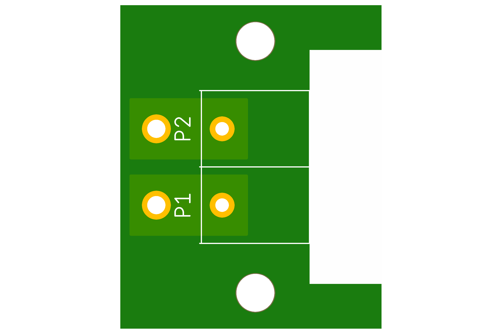
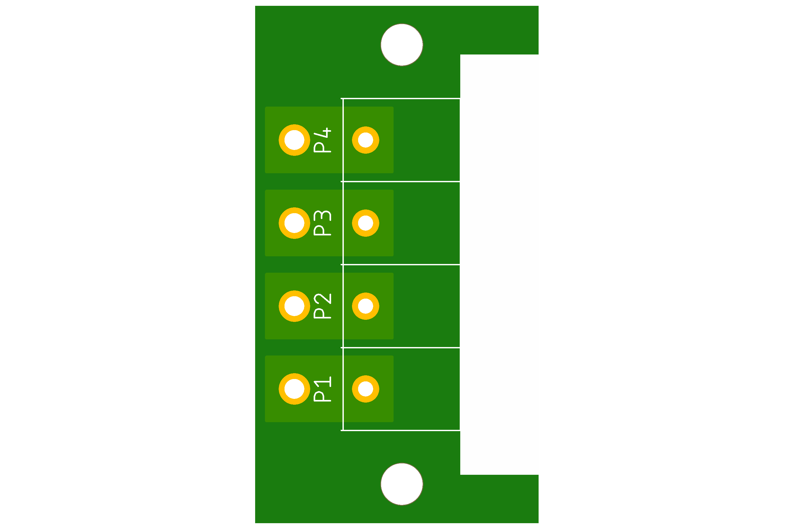
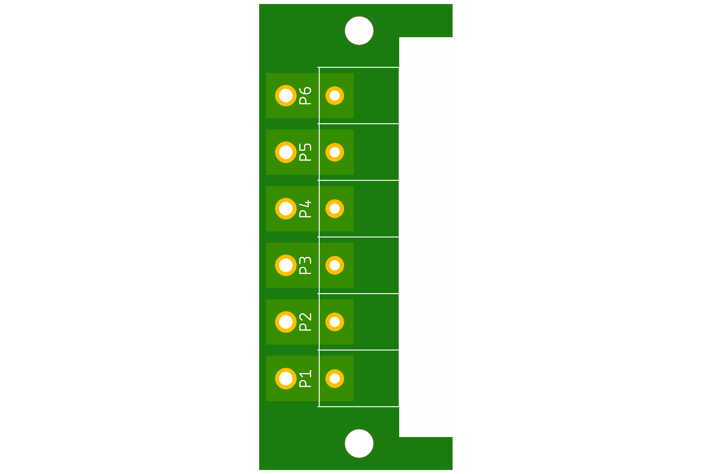
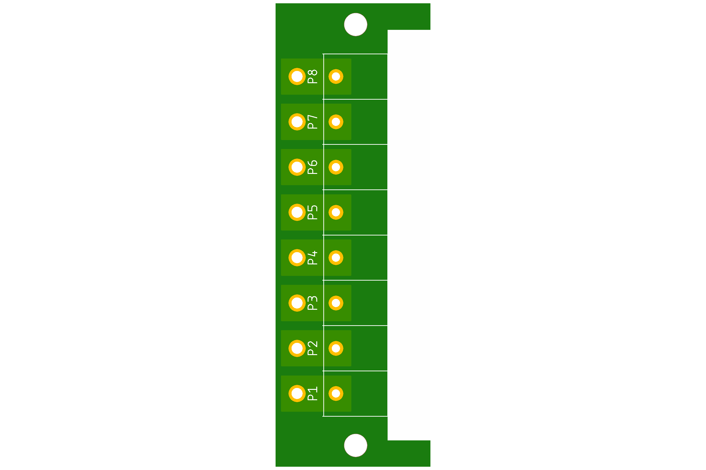

# DC-STB project

Direct Curent Screw Terminal Board for 8.5mm terminals.

## DC-STB-X2

**DC-STB-X2** two screw terminal board for 8.5mm pitch terminals.

Preview:

[Schematics in PDF format](doc/DC-STB-X2.pdf)

Features:

- Uses 8.5mm pitch terminals
- Current up to 10A
- Voltage up to 100V

CAM files are available.

## DC-STB-X4

**DC-STB-X4** four screw terminal board for 8.5mm pitch terminals.

Preview:

[Schematics in PDF format](doc/DC-STB-X4.pdf)

Features:

- Uses 8.5mm pitch terminals
- Current up to 10A
- Voltage up to 100V

CAM files are available.

## DC-STB-X6

**DC-STB-X6** six screw terminal board for 8.5mm pitch terminals.

Preview:

[Schematics in PDF format](doc/DC-STB-X6.pdf)

Features:

- Uses 8.5mm pitch terminals
- Current up to 10A
- Voltage up to 100V

CAM files are available.

## DC-STB-X8

**DC-STB-X8** eight screw terminal board for 8.5mm pitch terminals.

Preview:

[Schematics in PDF format](doc/DC-STB-X8.pdf)

Features:

- Uses 8.5mm pitch terminals
- Current up to 10A
- Voltage up to 100V

CAM files are available.

## Link

- [8.5mm terminals on LCSC](https://lcsc.com/products/Barrier-Terminal-Blocks_11073.html)

## How to help

Your contributions as code, resources or finances are welcome!
Please contact me directly over e-mail andriy.golovnya@gmail.com or over [GitHub profile](https://github.com/red-scorp).
Link for [Paypal donations](http://paypal.me/redscorp) and [Ko-Fi donations](http://ko-fi.com/redscorp), which are always welcome.
Thanks in advance!
