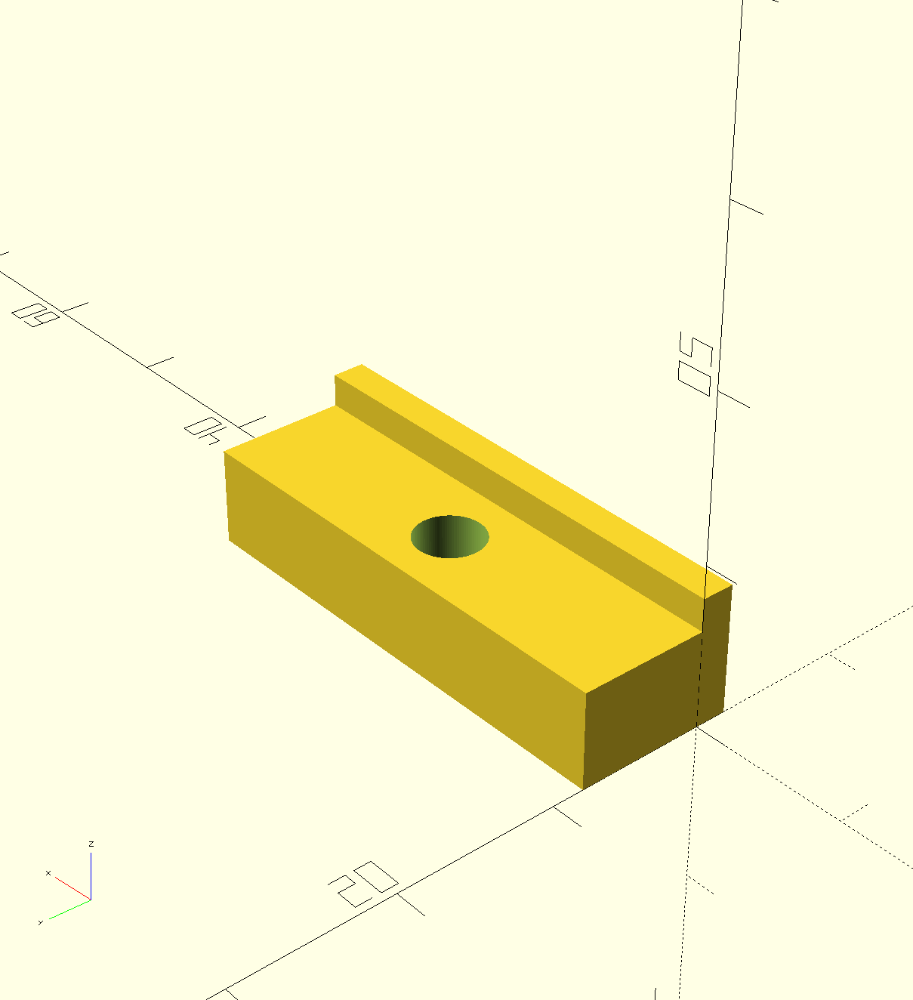

# DC/STB project

Direct Current Screw Terminal Board for 8.5mm terminals.

## DCSTB-X2

**DCSTB-X2** two screw terminal board for 8.5mm pitch terminals.

Preview:

[Schematics in PDF format](doc/DCSTB-X2.pdf)

Features:

- Uses 8.5mm pitch terminals
- Current up to 10A
- Voltage up to 100V

CAM files are available.

## DCSTB-X4

**DCSTB-X4** four screw terminal board for 8.5mm pitch terminals.

Preview:

[Schematics in PDF format](doc/DCSTB-X4.pdf)

Features:

- Uses 8.5mm pitch terminals
- Current up to 10A
- Voltage up to 100V

CAM files are available.

## DCSTB-X6

**DCSTB-X6** six screw terminal board for 8.5mm pitch terminals.

Preview:

[Schematics in PDF format](doc/DCSTB-X6.pdf)

Features:

- Uses 8.5mm pitch terminals
- Current up to 10A
- Voltage up to 100V

CAM files are available.

## DCSTB-X8

**DCSTB-X8** eight screw terminal board for 8.5mm pitch terminals.

Preview:

[Schematics in PDF format](doc/DCSTB-X8.pdf)

Features:

- Uses 8.5mm pitch terminals
- Current up to 10A
- Voltage up to 100V

CAM files are available.

## DCSTB-X10

**DCSTB-X10** ten screw terminal board for 8.5mm pitch terminals.

Preview:

[Schematics in PDF format](doc/DCSTB-X10.pdf)

Features:

- Uses 8.5mm pitch terminals
- Current up to 10A
- Voltage up to 100V

CAM files are available.

## DCSTB-STAND

**DCSTB-STAND** is a simple stand (foot) for DCSTB boards.

STL file is available.

## Links

- [8.5mm terminals on LCSC](https://lcsc.com/products/Barrier-Terminal-Blocks_11073.html)
- [8.5mm terminals on AliExpress](https://www.aliexpress.com/wholesale?SearchText=screw+terminal+8.5mm)
- [8.5mm terminals on Amazon](https://www.amazon.com/s?k=screw+terminal+8.5mm+pitch)
- [8.5mm terminals on Ebay](https://www.ebay.com/sch/i.html?_nkw=screw+terminal+8.5mm)

## How to help

Your contributions as code, resources or finances are welcome!
Please contact me directly over e-mail andriy.golovnya@gmail.com or over [GitHub profile](https://github.com/red-scorp).
Link for [Paypal donations](http://paypal.me/redscorp) and [Ko-Fi donations](http://ko-fi.com/redscorp), which are always welcome.
Thanks in advance!
